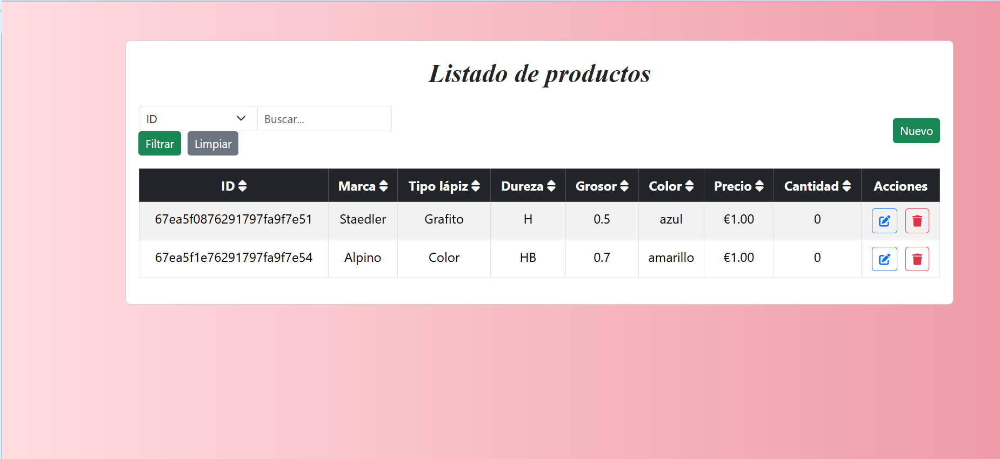
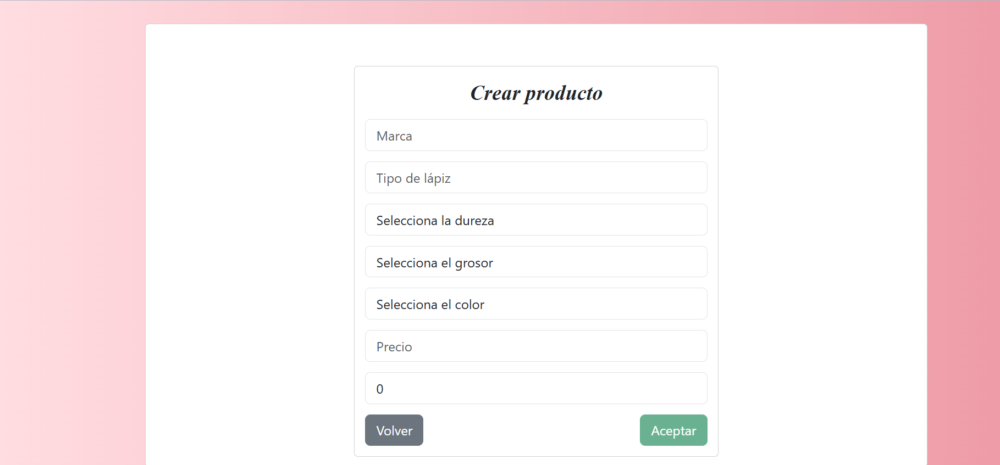
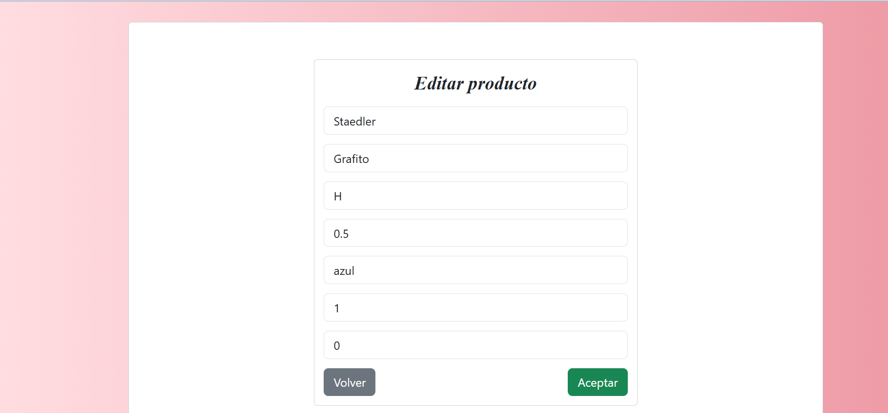

[](readme.md)

# Article Management with a MEAN Application

> *This project was developed within the subject **Architecture of Telematic Services***

---

## Index

- [Objective](#-objective)
- [Technologies Used](#-technologies-used)
- [Installation and Execution](#-installation-and-execution)
- [Main Features](#-main-features)
- [Interface Gallery](#-interface-gallery)
- [Article Model](#-article-model)
- [API Response Example](#-api-response-example)

---

## Objective

The goal of this project is to acquire the necessary skills to create and manage RESTful web services using the **MEAN** stack (MongoDB, Express, Angular, Node.js).

This system enables the management of products in an online store through a REST API and a web interface accessible via browser.

---

## Technologies Used

- **MongoDB**: NoSQL database where the articles are stored.
- **Express**: Backend framework to build the REST API.
- **Angular**: Frontend framework for the user interface.
- **Node.js**: Runtime environment for the backend.
- **Mongoose**: Library to connect Node.js with MongoDB.

---

## Installation and Execution

### 1. Clone the repository

```bash
git clone https://github.com/avelunatica/gestion-articulos-mean.git
cd gestion-articulos-mean
```

---

### 2. Backend (`/servidor`)

#### a) Install dependencies

```bash
cd servidor
npm install
```

#### b) Start the server

```bash
npm run dev
```

---

### 3. Frontend (`/cliente`)

#### a) Install dependencies

```bash
cd ../cliente
npm install
```

#### b) Start Angular

```bash
ng serve
```

The app will be available at: [http://localhost:4200](http://localhost:4200)

---

## Main Features

- **Article search**: by ID or attributes (brand, type, color...).
- **Create articles**: form to add new items.
- **Edit articles**: modify an existing article.
- **Delete articles**: confirmation before removal.
- **Dynamic table**: sortable and filterable columns.

---

## Interface Gallery

- **List**

- **Create**

- **Edit**


---

## Article Model

Each article in the database includes the following fields:

- `ID` (auto-generated)
- `Brand`
- `Type of pencil`
- `Hardness`
- `Thickness`
- `Color`
- `Price`
- `Quantity`

---

## API Response Example

```json
{
  "_id": "662f0b2c8c3f2a1234567890",
  "marca": "Faber-Castell",
  "tipo": "Lapis de cor",
  "dureza": "HB",
  "grosor": "0.7",
  "cor": "Red",
  "prezo": 1.25,
  "cantidade": 20
}
```

