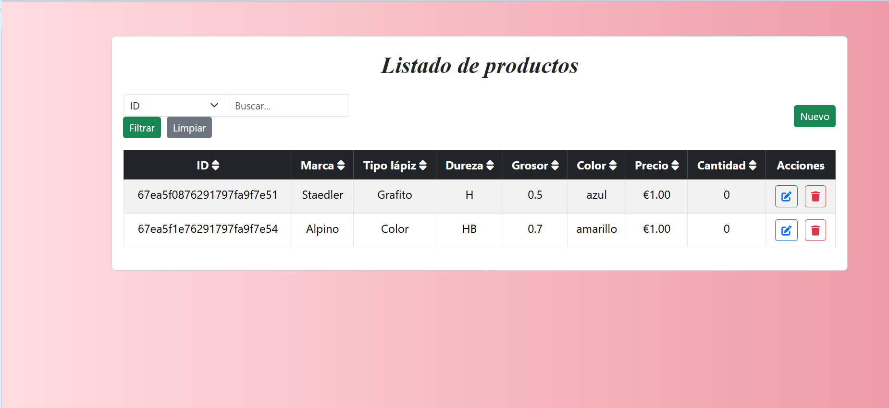

# Proxecto: Xestión de artigos cunha aplicación MEAN

> *Este proxecto foi desenvolvido no contexto da materia **Arquitectura de servizos telemáticos**


## 🌟 Obxectivo

O obxectivo deste traballo é adquirir as competencias necesarias para a creación e xestión de servizos web RESTful empregando a stack **MEAN** (MongoDB, Express, Angular, Node.js).

Este sistema permite a administración de artigos dunha tenda en liña mediante unha API REST e unha interface web accesible desde o navegador.

---

## 💠 Tecnoloxías empregadas

- **MongoDB**: Base de datos NoSQL onde se almacenan os artigos.
- **Express**: Framework de backend para crear a API REST.
- **Angular**: Framework frontend para a interface de usuario.
- **Node.js**: Entorno de execución para o backend.
- **Mongoose**: Libraría para conectar Node.js con MongoDB.

---

## 📁 Estrutura do proxecto

gestion-articulos-mean/
│
├── cliente/           → Aplicación Angular (frontend)
├── servidor/          → API REST con Express (backend)
└── README.md          → Este documento

---

## 🚀 Instalación e execución

### 1. Clonar o repositorio

```bash
git clone https://github.com/avelunatica/gestion-articulos-mean.git
cd gestion-articulos-mean
```

---

### 2. Backend (`/servidor`)

#### a) Instalar dependencias

```bash
cd servidor
npm install
```

#### b) Iniciar o servidor

```bash
npm run dev
```

---

### 3. Frontend (`/cliente`)

#### a) Instalar dependencias

```bash
cd ../cliente
npm install
```

#### b) Iniciar Angular

```bash
ng serve
```

A aplicación estará dispoñible en: [http://localhost:4200](http://localhost:4200)


---

## 🤩 Funcionalidades principais

- **Consulta de artigos**: buscador por ID ou atributos (marca, tipo, cor...).
- **Creación de artigos**: formulario para engadir artigos.
- **Modificación de artigos**: edición dun artigo seleccionado.
- **Eliminación de artigos**: borrado con confirmación.
- **Táboa dinámica**: ordenación e filtrado por columnas.

---

## 📦 Modelo de artigo

Cada artigo da base de datos inclúe os seguintes campos:

- `ID` (xerado automaticamente)
- `Marca`
- `Tipo de lapis`
- `Dureza`
- `Grosor`
- `Cor`
- `Prezo`
- `Cantidade`


